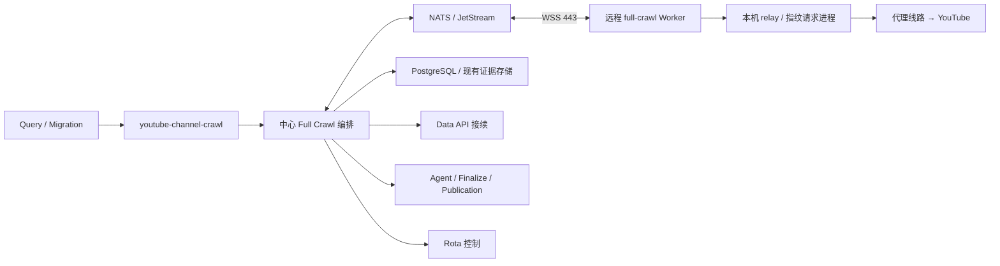

# 全量抓取远程执行方案

日期：2026-09-18。状态：设计提案，尚未实现或部署。

## 1. 目标与推荐方案

把 `youtube-channel-crawl` 的 YouTube 网络采集移到远程全量 Worker，中心保留调度、任务所有权、业务状态和发布。沿用增量节点的 NATS/WSS、JetStream、Rota 授权、本地 relay 和持久 spool，新增全量业务执行协议。

这里将“从中心调度中分离出去”解释为：中心决定抓什么、何时抓并确认结果，远程节点负责实际抓取。Query Discover 和手动迁移仍投递原业务队列。中心不再为已迁出的全量任务运行 YouTubeJS/指纹采集进程；Data API、Agent、Finalize 和发布继续在中心侧执行。

推荐一个频道占用一个执行租约，按“准入 → 上传列表 → 详情批次”交接。详情批次内部由节点连续执行，逐视频本地落盘、按批次回传。这样保留现有准入和目标冻结时点，同时避免逐视频远程请求中心领取任务。

一期远程支持 `channel-snapshot` 的 `youtubejs_full_v1/v2/v3` 冻结合约，必须覆盖当前默认的 v3 Data API 接续。历史 `legacy_full_v2` 和专门修复任务走明确的本地兼容执行路径，后续逐项迁移。普通全量采集远程化与历史任务完全退出本地，是两个独立验收点。

## 2. 当前代码事实

| 位置 | 当前行为 | 对拆分的影响 |
| --- | --- | --- |
| `services/qybullmq/src/worker.js` | 消费全量队列；区分 snapshot、detail/checkpoint repair；处理迁移启动、所有权、失败和 API 接续 | 不能只把队列名加入远程增量监督器 |
| `fullCrawlFetchContract.js` | 默认新 snapshot 使用 `youtubejs_full_v3`；历史合约保持冻结；部分非 snapshot 任务走 legacy | 必须按 job 类型与冻结合约选择执行方式 |
| `fullCrawlYoutubeJsFactory.js` | `admission → uploads → detail → close_fetch → handoff`；混合调用 YouTube 和 Store | 适合拆出共享采集 Module 与中心编排 Module |
| `fullCrawlYoutubeJsStore.js` | 准入、频道提升、目标集冻结、详情认领/写入、完成检查点 | 业务数据库写入留在中心，复用现有事务规则 |
| `fullCrawlYoutubeJs.js` | 装配数据库、YouTube、Data API fallback、候选状态通知和 Finalize | 该文件不能原样导入无数据库凭据的节点 |
| `channelCandidateAttemptFence.js`、`contentDetailExecutionFence.js` | 校验候选频道代次、BullMQ attempt 和详情执行所有权 | 全量必须使用自身业务 fence |
| `videoApiContinuation.js` | 持久 API 等待、BullMQ delayed、无网络结果回放、重新进入网络执行 | 不能让远程槽位一直等待 API 配额 |
| `remoteNodes/centerExecutionSupervisor.js` | 按远程 slot 创建中心 BullMQ consumer，当前固定增量队列和 mode | 需要按 Worker 类型选择 processor、queue 和恢复逻辑 |
| `remoteNodes/channelExecutionStore.js`、`incrementalBusinessFence.js` | 绑定增量 Plan、Feature Clock 和 incremental run | 不适用于全量，不能伪造 Plan ID 复用 |
| `remoteNodes/channelRouteStore.js` | 网络绑定校验中使用增量 run ID | 连同会话、绑定、回收校验一起按 workload 接入全量 |
| `remoteNodes/workerConfig.js`、`workerActivationStore.js` | role、mode、runtime revision 只允许增量 | 节点部署、注册、心跳、启用必须一起扩展 |
| `services/dashboard/src/nodeRuntime/collectDeployment.js`、`serverNodeWorkerDeployment.js` | 当前远程部署入口只实现增量 | 需要完整的全量部署和接单控制 |

以上来自本次仓库源码阅读，不代表对全部线上容器版本的实时核验。

## 3. 中心和节点的职责



| 中心保留 | 远程节点承担 |
| --- | --- |
| BullMQ 消费、续锁、重试与 delayed | About、频道页、上传列表和视频详情请求 |
| candidate、business run、dispatch generation 和 attempt 所有权 | YouTubeJS、Python 指纹请求进程、本机 Go relay |
| 设置快照、准入决策、目标集冻结、详情预留 | 按冻结设置和目标集执行采集 |
| Rota 管理、重试预算、国家切换决策和授权 | 执行签名路由授权，报告观察和停止回执 |
| 数据校验、content/comment 写入、检查点、既有证据存储 | 日志、逐视频本地检查点、结果分块回传 |
| Data API 密钥/配额/批次和 API 结果应用 | 回传可验证的 API 交接证据 |
| candidateSettled、Agent 状态、Finalize、发布 | 接受开始/排空/停止；恢复未确认结果 |

Worker 不持有中心 PostgreSQL、Redis、MinIO 管理凭据或 Rota 管理 token。复用节点专属 token、subject ACL、slot/instance 校验；全量和增量槽位分别授权。采集原始证据如需进入现有对象存储，由中心写入并记录关联。

## 4. Module 和 Interface 设计

### 4.1 共享采集 Module

从现有全量执行器提取 `FullCrawlCollector`，Interface 接受冻结输入、YouTube Adapter、持久 journal 和取消信号，输出采集证据及交接原因。业务规则继续共用 `fullCrawlYoutubeJsModel.js`、资格/活跃度/内容窗口规则、详情校验和共享 YouTubeJS 失败策略。

在采集 Seam 提供两个真实 Adapter：`LocalFullCrawlCollector` 和 `RemoteFullCrawlCollector`。本地执行与远程执行使用同一份采集策略；传输、恢复和路由细节封装在远程 Adapter 内。禁止把 Store 的每个方法直接变成公网 RPC，也不在节点复制一套数据库业务状态机。

建议中心面对的采集 Interface 是：

```text
collectStage(execution, immutableStageInput, signal)
    → verifiedStageEvidence | typedHandoff
```

结果接收、持久回执和网络停止由远程执行 Module 管理。`collectStage` 只有在该阶段证据满足接收/应用条件后才推进；网络变化、API 等待、取消、过期执行分别返回明确结果，不能用一个笼统 success 表示。

### 4.2 中心业务编排 Module

提取可被现有 `worker.js` 与远程入口共同调用的 Full Crawl job 生命周期，覆盖迁移启动、候选 attempt、business run、冻结合约、API gate、恢复、失败与完成事件。新增 `createCenterFullCrawlProcessor` 负责装配，不复制整份 `worker.js`。

中心继续调用现有业务写入规则。为远程批次应用增加“使用调用方事务”的内部 Seam，使以下内容在同一事务内提交：

1. 当前业务 fence 校验。
2. 对应 candidate/content/checkpoint 更新。
3. 该证据批次的 applied 标记。

不能在 fence 检查后另起无保护事务写入。网络等待不占用数据库事务或连接。

### 4.3 复用基础传输，分开业务校验

通用部分包括节点身份、NATS 请求/响应、JetStream 消息、分块、回执、journal、心跳和 slot 监督。增量与全量各自提供业务合约校验、执行准备、结果应用和恢复 Adapter。

必须审计 transport claim/renew、route grant/renew/release、session checkpoint、result receive/apply 及 recovery 各入口，确保按 capability 选择正确业务校验。不能仅在最初领取时检查全量身份。

建议新增标识，名称在实现时统一冻结：

```text
role:             fullcrawl
mode:             full_crawl_collect
slot:             full-crawl-N
capability:       youtube.full-crawl.v1
runtime_revision: youtubejs-full-crawl-v1
```

Rota 继续使用现有 `channel` role 和对应全量 task kind；节点 role 与 Rota role 是两套用途不同的标识。全量与增量使用独立接单数量、恢复记录和资源配额。

全量登记 role 沿用现有 Dashboard 的 `fullcrawl`，避免为同一类型引入第二个标识。

## 5. 正常执行协议

### 5.1 创建远程执行

中心只有在存在就绪全量 slot 时消费新网络任务，持有原 BullMQ 锁并续期。中心准备真实 business run/attempt，创建远程任务并绑定唯一 slot。任务输入包含：

- `queue_name/job_id`、`candidate_id/channel_id/run_id`、business run key 与 intent hash。
- `dispatch_generation`、候选 attempt fence、执行 attempt ID。
- 独立的运输 `task_id/generation`、node/slot/instance 身份。
- 冻结 fetch contract 和 hash、设置版本/快照、时间基准、内容数量和时间窗口。
- 当前业务检查点、恢复阶段；后续详情阶段增加 uploads/target hash。

业务代次和运输代次分别保存，不能互相替代。输入标识由中心生成，节点不自行生成 run、重置尝试次数或修改抓取合约。

### 5.2 频道准入：`collect_admission`

节点返回频道/About 原始及标准化证据。中心复用资格、删除/不可用频道和已有频道判断；提交准入后立即执行原 candidateSettled 通知，维持发现页和迁移批次进度。

不合格、已被提升或终止频道在这一阶段结束。只有中心确认准入，才进入上传列表阶段。这样不会因远程化把候选就绪通知拖到整个频道采完。

### 5.3 上传列表：`collect_uploads`

节点按冻结限制扫描并返回完整性、空列表、国家复查、活跃度所需证据。中心复用活跃度判定并调用 `commitUploads` 冻结目标集和顺序。

国家复查需要切换线路时，遵循现有停止网络请求、停止回执、线路退役、重新授权流程；不能在未停止的请求中途改代理。已有合法 uploads 检查点的重试不重新扫描目标集。

### 5.4 视频详情：`collect_details`

中心预留一批未完成目标，包含现有排除记录、内容类型证据及 API/重试策略。节点按原顺序串行处理，本地 fsync 每条视频的开始/完成证据；批次中不逐视频等待中心派单。

建议初始每批最多 20 个目标，按数据体积进一步缩小；这是待压测的提案值。结果达到 10 条、1 MiB 或 5 秒任一条件即可封包回传，阈值同样需要实测。中心按顺序验证并应用已接收前缀，未完成后缀保留可恢复状态。下一批在前一批达到应用检查点后派发。

必须新增详情批次预留，不可直接批量调用 `claimNextDetail` 把所有目标都记为已尝试。预留、实际开始、采集完成、业务应用分别记录；只有真实开始证据驱动对应详情尝试计数。失联中存在未确认开始的目标按不确定执行恢复，不能当成“肯定没试过”补充预算；Rota/业务执行预算仍由中心计账。实现前须用本地执行的失败样例固定该映射并通过对照测试。

现有详情写入要求目标处于正确执行 fence 下。远程批次应用在同一事务中完成必要状态转换和 `commitDetail` 的原业务规则；未开始后缀不计失败，不修改已完成目标。

### 5.5 Data API 接续

v3 合约在共享策略允许时返回 `api_required` 证据，包含准确的视频、执行身份、尝试证据和已有部分结果。节点在该位置停止当前详情批次的后续网络采集。

中心校验后，用原稳定 request ID（当前全量格式为 `["full", runId, videoId]` 的 JSON 字符串）持久提交 API 请求和接续状态。与结果应用一起做幂等保证；相同证据重传不能创建新 API 请求。

中心等节点停止网络并确认线路退役后，将 BullMQ job 进入现有 delayed/接续流程，释放采集 slot。API 就绪时先在中心回放已存结果；只有仍需 YouTube 请求时，才创建新的受管网络执行并从剩余目标续跑。API 等待不作为普通抓取失败，不占满远程节点。

v1/v2 不因远程化获得 v3 的 fallback 权限。网络重试、频道重试和 API 配额也不因跨节点重启而重置。

### 5.6 收尾

中心校验冻结目标中的每项均具有合法完成/排除/延后处置，并复用 `closeFetch`、Agent 状态协调、Finalize 和发布路径。`fetch complete` 不等同于 Agent 或业务发布完成。

一期沿用增量的保守释放方式：正常完成证据应用后再关闭会话和释放槽位；API 等待走专门交接。不要同时引入“结果刚收到就释放槽位”的另一套异步业务调度。

## 6. 传输、数据持久性和恢复

控制消息继续使用 NATS request/reply；结果使用独立 subject/stream，例如 `qy.remote.full.results.<nodeId>`，与增量分别设结果积压和容量限制，避免大频道耗尽增量结果存储。仍使用同一个 broker，故这不是 broker 故障隔离。

结果按批次拆成不超过现有 512 KiB 原始分块大小的消息，定义批次总大小、解压后大小和逐记录上限。不能把整个全量频道塞入现有 32 MiB 整频道增量结果限制。单个超限记录需要分片或明确报错，不能静默截断。节点 spool 配额、待确认窗口和中心应用并发均有上限；达到上限停止采集或接单，并保留未确认数据。

每批建议至少包含：`task_id/generation/stage_id/batch_id/sequence/input_hash/target_hash/payload_hash`。视频记录包含目标 ID、开始标识和观察时间。中心只接受冻结任务授权范围内的记录，重新校验必要字段和业务策略，不接受节点直接设置频道成功状态。

建议在 `remote_ingestion` 下新增全量专用 executions、stages、detail_reservations、result_batches/result_parts。具体 DDL 应与现有通用 task/receipt 表复用范围一起设计，避免同时维护两个运输租约真相。现有 crawler 业务表仍是业务状态的唯一来源。

确认语义：

1. `broker_ack`：JetStream 收到消息。
2. `durable_received`：中心已完整持久保存证据和 receipt；节点可删除对应已确认负载。
3. `applied`：中心已按业务 fence 应用该批次，恢复进度可前移。
4. `fetch_complete`：全量抓取完成；后续 Agent/发布另有状态。

`durable_received` 后中心承担证据恢复责任，因此必须在开放节点删除负载前实现中心恢复。中心不能清理尚未应用、API 等待或处于冲突调查的证据；已应用大负载可采用与增量一致的有界保留策略，幂等回执身份仍按任务保留规则保存。

| 故障位置 | 处理方式 |
| --- | --- |
| 节点重启、最终回执丢失 | 启动先扫描 journal/spool，重传未确认批次；相同身份/hash 返回原回执 |
| 中心收到结果后、业务应用前崩溃 | 新监督器恢复已接收批次；仍有效的执行幂等应用，已过期执行禁止直接写业务 |
| 业务写入后、applied 回复前崩溃 | 业务变更与 applied 标记同事务，重放返回已有结果 |
| BullMQ 重投或迁移生成新代次 | 校验 candidate/run/dispatch/attempt fence，旧执行不能覆盖新执行 |
| 新执行希望复用旧证据 | 中心显式核对同 run、合约、目标 hash 和观察有效性，在新 fence 下导入；不满足条件重采 |
| 节点失联但网络停止未确认 | 停止新领取；按授权有效期在本地阻止新请求，保留恢复状态；没有可验证停止证据不让新实例抢占旧线路 |
| API 提交前后崩溃 | 证据、稳定 request ID 和接续记录幂等恢复，不丢请求或增加配额消耗 |
| 磁盘满、损坏或结果冲突 | 停止领取并显示明确原因；不删除未确认数据以继续工作 |

保证目标是至少一次传输、幂等业务应用和过期执行拒写。进程/磁盘丢失仍可能导致重新采集，不承诺 YouTube 请求恰好一次。

## 7. 队列、兼容路径和容量

保留原 `youtube-channel-crawl` 队列、job ID、优先级、重试预算和 dispatch outbox。不要让仅支持新合约的远程 processor 无差别消费后，把不支持任务不断退回队列。

新增中心 processor 必须对队列内每种 job 有明确去向：

- 迁移启动/控制任务在中心执行，不派给节点。
- 支持合约的 snapshot 使用远程 Adapter。
- legacy、detail repair、checkpoint repair 等未迁移网络路径，通过共享生命周期中的本地兼容 Adapter 执行，并占用单独受限的本地槽位。
- 纯数据库/API 回放在中心执行，不占远程网络 slot。

一期为兼容路径保留本地网络能力；队列内所有历史网络路径迁完前，不能宣称中心完全不再进行全量相关网络请求。禁止把同一个真实任务复制投递到本地和远程队列做灰度。混合期可保留原本地消费者，由 BullMQ 分配唯一 job；远程消费者仍须能正确处理自己领到的兼容任务。

本地兼容容量不足时使用明确的容量等待状态，不能消费失败预算或忙循环。若真实历史流量使兼容路径成为阻塞，再另行设计持久路由/outbox；一期不新增第二套业务队列。

远程并发初始每 slot 一个频道。中心仍为远程 slot 保持轻量 consumer 和续锁，数据库/Redis/结果应用负载不会随采集迁出而消失。先复用现有模型，测量连接数和续锁延迟后再决定是否需要进一步调整。

Rota 容量按所有本地 channel 消费者（含兼容路径）、远程增量、远程全量及其他 channel 用途去重求和；不能把同一远程 slot 的中心 consumer 再算一次网络需求。业务调度分别使用实际可接单的 full/incremental 数量，不能把 Rota `channel.ready` 全部分配给两个队列。需同步检查 Controller 和 Feature Dispatch 容量口径。

## 8. 部署和页面

服务器节点页增加“全量抓取 Worker”，与增量分别显示已部署数、允许接单数、在线数、执行数和恢复阻塞数。全量不是 Query Discover；页面已有 Query role 不能直接改名冒用。

需要覆盖：部署预览、镜像与能力校验、独立 slot 编号、增加数量、开始、暂停/排空、删除空闲 Worker、重启恢复。相同服务器可运行两种容器，但一个 slot 固定一种 role；已有增量 slot 的配置 hash、deployment identity、token 和 spool 不因增加全量而改变。

现有单一 deployment mode/count 的登记结构需演进为按 role 保存部署清单和接单选择，同时兼容旧记录；不能只给 UI 加一个 count。删除 Worker 必须核对任务、结果和网络恢复状态。

建议复用现有 collect 镜像构建基础，增加独立全量入口和运行模式；冻结 digest，校验声明能力。CPU、内存、spool 和退出宽限用全量样本测量后定值，不能直接假定增量的 768 MiB/16 分钟适用于所有全量任务。

## 9. 实施顺序和验收

| 阶段 | 交付 | 通过条件 |
| --- | --- | --- |
| P0：冻结兼容矩阵 | job/contract/恢复状态清单；大频道结果、时长、内存、spool 基线；本地业务样例 | 明确每种任务的执行去向；定义 attempt 计账和批次预留语义 |
| P1：提取共享 Module | 全量生命周期、共享 Collector、Local Adapter；中心事务应用 Seam | 既有本地全量、迁移和修复测试通过；业务行为不变 |
| P2：远程核心 | 全量 capability、业务 fence、stage/batch 协议、节点 journal、结果应用、v3 API 接续、全量恢复 | 隔离 NATS/PostgreSQL/Redis/Rota 集成用例通过，节点无需中心基础设施凭据 |
| P3：部署管理 | Full slot 监督、role 登记、容量计数、Dashboard 部署/接单/排空/删除 | 同机增量和全量互不抢 slot；暂停后无新任务；可重试部署不改变旧身份 |
| P4：生产灰度 | 一台节点一个全量 slot，后续按 1 → 5 → 目标数量递增 | 真实 Query 来源和 Migration 来源均通过；核验业务发布和增量服务质量 |
| P5：兼容路径收口 | 按优先级支持修复任务和仍需处理的 legacy 合约，或明确保留专用兼容池 | 只有全部网络路径有远程实现且待恢复任务已收尾，才下线中心本地全量采集能力 |

P2 的必测场景：

- 准入拒绝、已有频道、删除频道、合法零内容、活跃度判定和国家复查。
- 普通视频、Shorts、直播/预告、登录限制、可选评论、时间窗口和详情失败重试。
- 冻结 v1/v2/v3 行为差异；v3 API 等待期间其他频道仍能执行，接续不重新抓已完成目标。
- 真实进程在准入、uploads 提交、视频 journal 落盘、结果接收/应用及 API 交接前后被终止。
- 重复/乱序/缺失分块、ACK 丢失、旧 generation、不同 payload 共用 ID、结果大小上限和 spool 耗尽。
- 新旧中心争用同一 slot、重复节点实例、Rota 租约丢失、网络停止回执迟到、排空和重启。
- 中心接收已确认数据后崩溃，节点已删负载仍能恢复；已确认但未应用证据不被保留清理误删。
- 本地与远程在固定响应样例下得到相同准入、目标顺序、处置、字段、评论和发布结果。

生产观测至少包括：就绪容量、任务等待、采集时长、结果接收/应用延迟、JetStream 积压、spool 用量、DB 事务和连接等待、BullMQ 续锁、重试原因、API 接续时长、候选/Run/Finalize/Publication 完成状态，以及增量队列延迟。吞吐收益通过测量给出，不预先承诺倍数。

升级先部署兼容中心及显式 schema 迁移，再部署全量节点并启用接单。灰度使用单一路径执行真实任务，对照靠固定样例或独立验证数据，避免同一生产 run 双写。

回退先停止全量新接单并排空，确认远程任务、未应用结果、API 接续和网络绑定已收尾，再恢复本地接单。保留支持全量回执恢复的中心版本和新增表；存在未确认结果时不能直接回滚到不认识新协议的中心。初始 schema 只做兼容性新增，进程启动不自动迁移。

## 10. 建议决策

采用“共享采集策略 + 全量专属业务协议 + 复用远程基础设施”。首先交付支持当前 v3 snapshot 和故障恢复的远程全量链路，再接入节点页和生产灰度。阶段交接保留准入/目标冻结语义，详情批次降低跨网通信开销；历史修复和 legacy 路径有明确的兼容退出计划。

后续已开始实现页面登记：新增服务器可选择全量或增量功能类型，保存为 `workerRole`，并在卡片、详情及 Worker 管理中展示。类型目录由 `services/dashboard/src/nodeWorkerTypes.js` 统一维护。全量可登记和初始化，远程部署仍未开放；已有部署不能通过编辑元数据切换类型。这一步不代表全量远程执行链路已实现，后续混合部署仍需第 8 节的按 role 部署结构。
