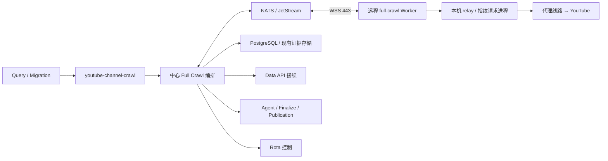

# 全量抓取远程执行完整实施计划（待审阅）

最新生产状态（2026-09-20 08:36 UTC）：P6 全量 Worker 执行准备已完成。中心 execution 已开启，兼容槽启动成功，Rota 就绪容量 125；全量节点 executionAvailable=true，接单保持 0。原 62 个增量槽位全部恢复并通过连续采样，接单配置完整保留。尚未开始真实频道灰度，P6 整体验收未完成。详见 [P6 执行准备](FULL_CRAWL_REMOTE_P6_EXECUTION_READY_20260920.md)及 `reports/fullcrawl-p6-execution-ready-20260920.json`。下文较早状态保留为阶段历史。

更新日期：2026-09-20。状态：P0～P5 已完成隔离验收。P5 已补齐真实中心执行装配、原兼容 processor、来源/合同矩阵、增量回归、显式迁移/回退检查和最终分发镜像。最新证据与测试边界见 [P5 发布验收](FULL_CRAWL_REMOTE_P5_RELEASE_20260920.md)；下一阶段为 P6，生产全量远程链路未部署。

用户于 2026-09-20 在环境准备后要求执行下一步，已开始 P2 隔离实现。此前 Dashboard 类型选择的完成记录不代表全量远程链路已经上线；生产发布仍须通过后续阶段门槛。

## 审阅摘要

目标是让用户在“服务器节点”页面选择 `youtube-channel-crawl`、初始化服务器、部署全量 Worker、设置接单数量并开始运行后，真实完成频道采集、结果入库以及后续业务发布。

当前远程增量已经可用；全量只有类型登记入口可用。剩余工作分为 **14 个工作包、7 个阶段**，包括中心调度、节点执行、结果和恢复、页面部署接线、测试与生产灰度。不能把开放一个部署按钮算作完成。

推荐首版采用专用全量节点或尚无 Worker 部署的服务器，一台服务器登记一种功能类型。现有两台增量服务器保留当前用途和接单配置。同机混合部署、跨类型容器转换及所有历史网络路径退出中心，列为后续扩展，避免首版同时改造运行中的部署身份。

开发与隔离验证不需要改变线上任务。上线兼容中心可能需要增量暂缓新领取并排空在途任务；数据库迁移和全量运行也会共享基础设施资源。因此目标是保护任务所有权、检查点和已确认结果，并控制吞吐影响，不承诺整个改造过程完全零影响或零重采。

### 当前状态与完成定义

| 能力 | 当前状态 | 本计划完成后 |
| --- | --- | --- |
| 新增页面选择全量/增量，保存并回显 | 已上线 | 保留，并接通实际部署能力 |
| 远程增量部署与采集 | 已上线 | 通过回归和生产观测确认继续正常运行 |
| 全量服务器登记、SSH/监控初始化 | 已具备登记及通用初始化入口 | 完成从登记到全量 Worker 就绪的流程 |
| 全量 Worker 部署、任务领取和采集 | 未接通 | 支持普通全量 snapshot 和原冻结 v1/v2/v3 合约 |
| 全量远程回传、入库、API 接续和恢复 | 未接通 | 完整验证后开放生产接单 |
| 同机全量/增量混合部署及跨类型转换 | 未实现 | 不包含在首版，后续单独实施 |
| 历史 legacy 和专门修复任务全面远程化 | 未实现 | 首版保留明确兼容路径，后续迁移 |

最近一次线上验证为 2026-09-18 Dashboard 类型选择发布期间：两台节点分别有 47、15 个远程增量 Worker，全部在线，队列持续推进。这是历史验证基线，不是此刻实时状态；正式实施和上线前必须重新读取实际数量、任务与资源状态。见 [类型选择上线记录](NODE_WORKER_TYPES_ROLLOUT_20260918.md)。

首版验收同时要求：新增全量节点可部署并领取真实任务；Query 来源和 Migration 来源全量均成功；数据、处置和发布与原逻辑一致；API 等待释放槽位且可接续；崩溃重试不覆盖新执行；现有增量通过回归和上线观测。任一项未通过，保持全量接单关闭。

## 1. 目标与推荐方案

把 `youtube-channel-crawl` 的 YouTube 网络采集移到远程全量 Worker，中心保留调度、任务所有权、业务状态和发布。沿用增量节点的 NATS/WSS、JetStream、Rota 授权、本地 relay 和持久 spool，新增全量业务执行协议。

这里将“从中心调度中分离出去”解释为：中心决定抓什么、何时抓并确认结果，远程节点负责实际抓取。Query Discover 和手动迁移仍投递原业务队列。中心不再为已迁出的全量任务运行 YouTubeJS/指纹采集进程；Data API、Agent、Finalize 和发布继续在中心侧执行。

推荐一个频道占用一个执行租约，按“准入 → 上传列表 → 详情批次”交接。详情批次内部由节点连续执行，逐视频本地落盘、按批次回传。这样保留现有准入和目标冻结时点，同时避免逐视频远程请求中心领取任务。

一期远程支持 `channel-snapshot` 的 `youtubejs_full_v1/v2/v3` 冻结合约，必须覆盖当前默认的 v3 Data API 接续。历史 `legacy_full_v2` 和专门修复任务走明确的本地兼容执行路径，后续逐项迁移。普通全量采集远程化与历史任务完全退出本地，是两个独立验收点。

## 2. 当前代码事实

| 位置 | 当前行为 | 对拆分的影响 |
| --- | --- | --- |
| `services/qybullmq/src/worker.js` | 消费全量队列；区分 snapshot、detail/checkpoint repair；处理迁移启动、所有权、失败和 API 接续 | 不能只把队列名加入远程增量监督器 |
| `fullCrawlFetchContract.js` | 默认新 snapshot 使用 `youtubejs_full_v3`；历史合约保持冻结；部分非 snapshot 任务走 legacy | 必须按 job 类型与冻结合约选择执行方式 |
| `fullCrawlYoutubeJsFactory.js` | `admission → uploads → detail → close_fetch → handoff`；混合调用 YouTube 和 Store | 适合拆出共享采集 Module 与中心编排 Module |
| `fullCrawlYoutubeJsStore.js` | 准入、频道提升、目标集冻结、详情认领/写入、完成检查点 | 业务数据库写入留在中心，复用现有事务规则 |
| `fullCrawlYoutubeJs.js` | 装配数据库、YouTube、Data API fallback、候选状态通知和 Finalize | 该文件不能原样导入无数据库凭据的节点 |
| `channelCandidateAttemptFence.js`、`contentDetailExecutionFence.js` | 校验候选频道代次、BullMQ attempt 和详情执行所有权 | 全量必须使用自身业务 fence |
| `videoApiContinuation.js` | 持久 API 等待、BullMQ delayed、无网络结果回放、重新进入网络执行 | 不能让远程槽位一直等待 API 配额 |
| `remoteNodes/centerExecutionSupervisor.js` | 按远程 slot 创建中心 BullMQ consumer，当前固定增量队列和 mode | 需要按 Worker 类型选择 processor、queue 和恢复逻辑 |
| `remoteNodes/channelExecutionStore.js`、`incrementalBusinessFence.js` | 绑定增量 Plan、Feature Clock 和 incremental run | 不适用于全量，不能伪造 Plan ID 复用 |
| `remoteNodes/channelRouteStore.js` | 网络绑定校验中使用增量 run ID | 连同会话、绑定、回收校验一起按 workload 接入全量 |
| `remoteNodes/workerConfig.js`、`workerActivationStore.js` | role、mode、runtime revision 只允许增量 | 节点部署、注册、心跳、启用必须一起扩展 |
| `services/dashboard/src/nodeRuntime/collectDeployment.js`、`serverNodeWorkerDeployment.js` | 当前远程部署入口只实现增量 | 需要完整的全量部署和接单控制 |

以上来自本次仓库源码阅读，不代表对全部线上容器版本的实时核验。

## 3. 中心和节点的职责



| 中心保留 | 远程节点承担 |
| --- | --- |
| BullMQ 消费、续锁、重试与 delayed | About、频道页、上传列表和视频详情请求 |
| candidate、business run、dispatch generation 和 attempt 所有权 | YouTubeJS、Python 指纹请求进程、本机 Go relay |
| 设置快照、准入决策、目标集冻结、详情预留 | 按冻结设置和目标集执行采集 |
| Rota 管理、重试预算、国家切换决策和授权 | 执行签名路由授权，报告观察和停止回执 |
| 数据校验、content/comment 写入、检查点、既有证据存储 | 日志、逐视频本地检查点、结果分块回传 |
| Data API 密钥/配额/批次和 API 结果应用 | 回传可验证的 API 交接证据 |
| candidateSettled、Agent 状态、Finalize、发布 | 接受开始/排空/停止；恢复未确认结果 |

Worker 不持有中心 PostgreSQL、Redis、MinIO 管理凭据或 Rota 管理 token。复用节点专属 token、subject ACL、slot/instance 校验；全量和增量槽位分别授权。采集原始证据如需进入现有对象存储，由中心写入并记录关联。

## 4. Module 和 Interface 设计

### 4.1 共享采集 Module

从现有全量执行器提取 `FullCrawlCollector`，Interface 接受冻结输入、YouTube Adapter、持久 journal 和取消信号，输出采集证据及交接原因。业务规则继续共用 `fullCrawlYoutubeJsModel.js`、资格/活跃度/内容窗口规则、详情校验和共享 YouTubeJS 失败策略。

在采集 Seam 提供两个真实 Adapter：`LocalFullCrawlCollector` 和 `RemoteFullCrawlCollector`。本地执行与远程执行使用同一份采集策略；传输、恢复和路由细节封装在远程 Adapter 内。禁止把 Store 的每个方法直接变成公网 RPC，也不在节点复制一套数据库业务状态机。

建议中心面对的采集 Interface 是：

```text
collectStage(execution, immutableStageInput, signal)
    → verifiedStageEvidence | typedHandoff
```

结果接收、持久回执和网络停止由远程执行 Module 管理。`collectStage` 只有在该阶段证据满足接收/应用条件后才推进；网络变化、API 等待、取消、过期执行分别返回明确结果，不能用一个笼统 success 表示。

### 4.2 中心业务编排 Module

提取可被现有 `worker.js` 与远程入口共同调用的 Full Crawl job 生命周期，覆盖迁移启动、候选 attempt、business run、冻结合约、API gate、恢复、失败与完成事件。新增 `createCenterFullCrawlProcessor` 负责装配，不复制整份 `worker.js`。

中心继续调用现有业务写入规则。为远程批次应用增加“使用调用方事务”的内部 Seam，使以下内容在同一事务内提交：

1. 当前业务 fence 校验。
2. 对应 candidate/content/checkpoint 更新。
3. 该证据批次的 applied 标记。

不能在 fence 检查后另起无保护事务写入。网络等待不占用数据库事务或连接。

### 4.3 复用基础传输，分开业务校验

通用部分包括节点身份、NATS 请求/响应、JetStream 消息、分块、回执、journal、心跳和 slot 监督。增量与全量各自提供业务合约校验、执行准备、结果应用和恢复 Adapter。

必须审计 transport claim/renew、route grant/renew/release、session checkpoint、result receive/apply 及 recovery 各入口，确保按 capability 选择正确业务校验。不能仅在最初领取时检查全量身份。

建议新增标识，名称在实现时统一冻结：

```text
role:             fullcrawl
mode:             full_crawl_collect
slot:             full-crawl-N
capability:       youtube.full-crawl.v1
runtime_revision: youtubejs-full-crawl-v1
```

Rota 继续使用现有 `channel` role 和对应全量 task kind；节点 role 与 Rota role 是两套用途不同的标识。全量与增量使用独立接单数量、恢复记录和资源配额。

全量登记 role 沿用现有 Dashboard 的 `fullcrawl`，避免为同一类型引入第二个标识。

## 5. 正常执行协议

### 5.1 创建远程执行

中心只有在存在就绪全量 slot 时消费新网络任务，持有原 BullMQ 锁并续期。中心准备真实 business run/attempt，创建远程任务并绑定唯一 slot。任务输入包含：

- `queue_name/job_id`、`candidate_id/channel_id/run_id`、business run key 与 intent hash。
- `dispatch_generation`、候选 attempt fence、执行 attempt ID。
- 独立的运输 `task_id/generation`、node/slot/instance 身份。
- 冻结 fetch contract 和 hash、设置版本/快照、时间基准、内容数量和时间窗口。
- 当前业务检查点、恢复阶段；后续详情阶段增加 uploads/target hash。

业务代次和运输代次分别保存，不能互相替代。输入标识由中心生成，节点不自行生成 run、重置尝试次数或修改抓取合约。

### 5.2 频道准入：`collect_admission`

节点返回频道/About 原始及标准化证据。中心复用资格、删除/不可用频道和已有频道判断；提交准入后立即执行原 candidateSettled 通知，维持发现页和迁移批次进度。

不合格、已被提升或终止频道在这一阶段结束。只有中心确认准入，才进入上传列表阶段。这样不会因远程化把候选就绪通知拖到整个频道采完。

### 5.3 上传列表：`collect_uploads`

节点按冻结限制扫描并返回完整性、空列表、国家复查、活跃度所需证据。中心复用活跃度判定并调用 `commitUploads` 冻结目标集和顺序。

国家复查需要切换线路时，遵循现有停止网络请求、停止回执、线路退役、重新授权流程；不能在未停止的请求中途改代理。已有合法 uploads 检查点的重试不重新扫描目标集。

### 5.4 视频详情：`collect_details`

中心预留一批未完成目标，包含现有排除记录、内容类型证据及 API/重试策略。节点按原顺序串行处理，本地 fsync 每条视频的开始/完成证据；批次中不逐视频等待中心派单。

建议初始每批最多 20 个目标，按数据体积进一步缩小；这是待压测的提案值。结果达到 10 条、1 MiB 或 5 秒任一条件即可封包回传，阈值同样需要实测。中心按顺序验证并应用已接收前缀，未完成后缀保留可恢复状态。下一批在前一批达到应用检查点后派发。

必须新增详情批次预留，不可直接批量调用 `claimNextDetail` 把所有目标都记为已尝试。预留、实际开始、采集完成、业务应用分别记录；只有真实开始证据驱动对应详情尝试计数。失联中存在未确认开始的目标按不确定执行恢复，不能当成“肯定没试过”补充预算；Rota/业务执行预算仍由中心计账。实现前须用本地执行的失败样例固定该映射并通过对照测试。

现有详情写入要求目标处于正确执行 fence 下。远程批次应用在同一事务中完成必要状态转换和 `commitDetail` 的原业务规则；未开始后缀不计失败，不修改已完成目标。

### 5.5 Data API 接续

v3 合约在共享策略允许时返回 `api_required` 证据，包含准确的视频、执行身份、尝试证据和已有部分结果。节点在该位置停止当前详情批次的后续网络采集。

中心校验后，用原稳定 request ID（当前全量格式为 `["full", runId, videoId]` 的 JSON 字符串）持久提交 API 请求和接续状态。与结果应用一起做幂等保证；相同证据重传不能创建新 API 请求。

中心等节点停止网络并确认线路退役后，将 BullMQ job 进入现有 delayed/接续流程，释放采集 slot。API 就绪时先在中心回放已存结果；只有仍需 YouTube 请求时，才创建新的受管网络执行并从剩余目标续跑。API 等待不作为普通抓取失败，不占满远程节点。

v1/v2 不因远程化获得 v3 的 fallback 权限。网络重试、频道重试和 API 配额也不因跨节点重启而重置。

### 5.6 收尾

中心校验冻结目标中的每项均具有合法完成/排除/延后处置，并复用 `closeFetch`、Agent 状态协调、Finalize 和发布路径。`fetch complete` 不等同于 Agent 或业务发布完成。

一期沿用增量的保守释放方式：正常完成证据应用后再关闭会话和释放槽位；API 等待走专门交接。不要同时引入“结果刚收到就释放槽位”的另一套异步业务调度。

## 6. 传输、数据持久性和恢复

控制消息继续使用 NATS request/reply；结果使用独立 subject/stream，例如 `qy.remote.full.results.<nodeId>`，与增量分别设结果积压和容量限制，避免大频道耗尽增量结果存储。仍使用同一个 broker，故这不是 broker 故障隔离。

结果按批次拆成不超过现有 512 KiB 原始分块大小的消息，定义批次总大小、解压后大小和逐记录上限。不能把整个全量频道塞入现有 32 MiB 整频道增量结果限制。单个超限记录需要分片或明确报错，不能静默截断。节点 spool 配额、待确认窗口和中心应用并发均有上限；达到上限停止采集或接单，并保留未确认数据。

每批建议至少包含：`task_id/generation/stage_id/batch_id/sequence/input_hash/target_hash/payload_hash`。视频记录包含目标 ID、开始标识和观察时间。中心只接受冻结任务授权范围内的记录，重新校验必要字段和业务策略，不接受节点直接设置频道成功状态。

建议在 `remote_ingestion` 下新增全量专用 executions、stages、detail_reservations、result_batches/result_parts。具体 DDL 应与现有通用 task/receipt 表复用范围一起设计，避免同时维护两个运输租约真相。现有 crawler 业务表仍是业务状态的唯一来源。

确认语义：

1. `broker_ack`：JetStream 收到消息。
2. `durable_received`：中心已完整持久保存证据和 receipt；节点可删除对应已确认负载。
3. `applied`：中心已按业务 fence 应用该批次，恢复进度可前移。
4. `fetch_complete`：全量抓取完成；后续 Agent/发布另有状态。

`durable_received` 后中心承担证据恢复责任，因此必须在开放节点删除负载前实现中心恢复。中心不能清理尚未应用、API 等待或处于冲突调查的证据；已应用大负载可采用与增量一致的有界保留策略，幂等回执身份仍按任务保留规则保存。

| 故障位置 | 处理方式 |
| --- | --- |
| 节点重启、最终回执丢失 | 启动先扫描 journal/spool，重传未确认批次；相同身份/hash 返回原回执 |
| 中心收到结果后、业务应用前崩溃 | 新监督器恢复已接收批次；仍有效的执行幂等应用，已过期执行禁止直接写业务 |
| 业务写入后、applied 回复前崩溃 | 业务变更与 applied 标记同事务，重放返回已有结果 |
| BullMQ 重投或迁移生成新代次 | 校验 candidate/run/dispatch/attempt fence，旧执行不能覆盖新执行 |
| 新执行希望复用旧证据 | 中心显式核对同 run、合约、目标 hash 和观察有效性，在新 fence 下导入；不满足条件重采 |
| 节点失联但网络停止未确认 | 停止新领取；按授权有效期在本地阻止新请求，保留恢复状态；没有可验证停止证据不让新实例抢占旧线路 |
| API 提交前后崩溃 | 证据、稳定 request ID 和接续记录幂等恢复，不丢请求或增加配额消耗 |
| 磁盘满、损坏或结果冲突 | 停止领取并显示明确原因；不删除未确认数据以继续工作 |

保证目标是至少一次传输、幂等业务应用和过期执行拒写。进程/磁盘丢失仍可能导致重新采集，不承诺 YouTube 请求恰好一次。

## 7. 队列、兼容路径和容量

保留原 `youtube-channel-crawl` 队列、job ID、优先级、重试预算和 dispatch outbox。不要让仅支持新合约的远程 processor 无差别消费后，把不支持任务不断退回队列。

新增中心 processor 必须对队列内每种 job 有明确去向：

- 迁移启动/控制任务在中心执行，不派给节点。
- 支持合约的 snapshot 使用远程 Adapter。
- legacy、detail repair、checkpoint repair 等未迁移网络路径，通过共享生命周期中的本地兼容 Adapter 执行，并占用单独受限的本地槽位。
- 纯数据库/API 回放在中心执行，不占远程网络 slot。

一期为兼容路径保留本地网络能力；队列内所有历史网络路径迁完前，不能宣称中心完全不再进行全量相关网络请求。禁止把同一个真实任务复制投递到本地和远程队列做灰度。混合期可保留原本地消费者，由 BullMQ 分配唯一 job；远程消费者仍须能正确处理自己领到的兼容任务。

本地兼容容量不足时使用明确的容量等待状态，不能消费失败预算或忙循环。若真实历史流量使兼容路径成为阻塞，再另行设计持久路由/outbox；一期不新增第二套业务队列。

远程并发初始每 slot 一个频道。中心仍为远程 slot 保持轻量 consumer 和续锁，数据库/Redis/结果应用负载不会随采集迁出而消失。先复用现有模型，测量连接数和续锁延迟后再决定是否需要进一步调整。

Rota 容量按所有本地 channel 消费者（含兼容路径）、远程增量、远程全量及其他 channel 用途去重求和；不能把同一远程 slot 的中心 consumer 再算一次网络需求。业务调度分别使用实际可接单的 full/incremental 数量，不能把 Rota `channel.ready` 全部分配给两个队列。需同步检查 Controller 和 Feature Dispatch 容量口径。

## 8. 部署和页面

新增服务器的 `workerRole` 选择已经上线，目录由 `services/dashboard/src/nodeWorkerTypes.js` 维护。本计划的页面工作是接通所选类型的真实部署和管理能力。全量不是 Query Discover，不能把 Query role 改名冒用。

### 8.1 首版用户操作流程

1. 添加一台未部署 Worker 的服务器，选择“全量抓取 / youtube-channel-crawl”。
2. 完成 SSH、监控、Docker/Compose 和运行目录准备。
3. 查看全量部署预览，填写数量，部署全量镜像；中心核验节点身份和运行能力。
4. 页面显示部署、连接和就绪状态。新 Worker 默认不接单，由用户显式设置额度并开始。
5. 按额度领取全量任务，查看阶段、结果回传、中心处理和恢复等待状态。
6. 随时调小/暂停新接单，已有任务继续收尾；排空后允许删除空闲 Worker。

一个 slot 固定一种 role。首版以新增专用全量服务器或无部署记录的节点为入口，不通过编辑元数据把现有增量节点变成全量节点。节点登记中的单一 mode/count 可以在明确类型后继续用于专用节点；中心的角色解析、容量统计、凭据和部署校验仍需完整扩展，不能只把 `deployable` 改为 true。

全量与增量分别显示已部署、允许接单、在线、执行和恢复等待数量。扩容沿用该角色已有部署身份及 spool；删除必须核对任务、未应用结果、API 交接和网络停止状态。初始化成功、容器启动、连接中心、就绪、允许接单分别显示，不能用“部署成功”代替“可采集”。

### 8.2 镜像和配置

复用现有 collect 镜像构建基础，增加全量入口和运行模式，按不可变 digest 部署。验证 profile/采集策略版本、执行协议和全量能力。CPU、内存、spool、运行时长和退出宽限须用全量样本测量，不能直接假定增量的限制适用于全量。

中心全量调度开关默认关闭，并有独立的允许节点/slot 范围和全量接单总上限。协议不兼容、schema 缺失或中心能力未就绪时明确拒绝启用，不能静默退回增量模式。待端到端验证通过后，页面才开放全量部署。

### 8.3 后续扩展

同一服务器承载两种类型时，必须把当前单一部署记录演进为按 role 保存部署清单、镜像、槽位和接单选择，并兼容旧记录。不能直接在现有增量部署下创建一个不同 role 的容器，或复用其部署 hash。

运行时调整先区分“允许接单数量”和“实际容器数量”。跨类型转换必须排空任务与待确认数据、释放原网络，再替换容器；不支持把执行中的增量任务直接切换成全量任务。

## 9. 14 个工作包

以下各项是尚待完成的全量工作包；部分基础设施已有增量实现，复用时仍需验证全量业务语义。

| 编号 | 工作包与主要产物 | 依赖 | 完成标准 |
| --- | --- | --- | --- |
| W01 | job/contract/恢复状态兼容矩阵、线上差异清单、资源与增量基线 | 无 | 普通 snapshot、控制、API 回放、legacy 和 repair 各有明确执行去向 |
| W02 | 共享 Full Crawl Collector、Local Adapter、可复用 job 生命周期及事务应用 Interface | W01 | 原本地全量、迁移、修复和增量回归通过，策略与预算不变 |
| W03 | 全量 role/mode/capability、注册、心跳、就绪和角色配置；新增 schema | W01 | 旧增量仍兼容；未知或不匹配能力不能接单 |
| W04 | 中心全量 processor/slot 监督、队列续锁、并发与容量控制、兼容路径分流 | W02、W03 | 正确消费原队列，不混领增量任务，不因无容量耗尽失败预算 |
| W05 | 阶段输入快照、指令/结果合约、版本、大小上限、错误与交接状态 | W01、W02 | 各阶段能关联同一真实业务执行，参数和目标不能被节点改写 |
| W06 | candidate/run/dispatch/attempt/route 所有权校验及事务内写入保护 | W03、W05 | 过期执行、错误节点、重复实例和越权目标均被拒绝 |
| W07 | 节点全量入口、阶段执行、journal、逐视频检查点和本地背压 | W02、W05、W06 | 无中心基础设施凭据即可采集；已执行前缀可恢复 |
| W08 | 全量结果 stream、分块、持久回执、顺序应用、去重与内容写入 | W05、W06、W07 | 大频道分批完成；结果与 applied 标记保持事务一致 |
| W09 | 全量 Rota/session/profile 接线、续租、国家复查、停网和线路退役 | W03、W05、W06 | 保留原网络身份/预算，旧请求停止前不抢占或换线 |
| W10 | v3 API 交接、稳定请求 ID、配额等待、结果回放和重新进入网络执行 | W04、W07、W08、W09 | 等待时释放采集槽位；v1/v2 不擅自获得 fallback 权限 |
| W11 | 中心/节点重启、丢失 ACK、重投、过期批次、spool 异常的恢复 | W04、W06～W10 | 已确认结果可恢复，旧代次不能写入，不重置重试预算 |
| W12 | 全量镜像/安装包、部署登记、资源计数、页面预览和全量接单管理 | W03～W11 | 真正实现“新增 → 初始化 → 部署 → 就绪 → 开始 → 排空/删除” |
| W13 | 本地/远程一致性、协议、安全边界、故障注入及增量回归测试包 | 随前述工作持续补充，发布前汇总 | 在隔离真实依赖中通过关键测试，证据可复现 |
| W14 | 发布包、显式迁移、增量保护操作、单 Worker 灰度、扩容及回退记录 | W01～W13 | 真实全量数据与发布验证通过，增量无可归因于本次变更的正确性回归 |

## 10. 分阶段交付和停止点

| 阶段 | 对应工作 | 可审阅交付物 | 进入下一阶段的条件 | 是否改变线上 |
| --- | --- | --- | --- | --- |
| P0 盘点与冻结设计 | W01 | 兼容矩阵、源代码/线上差异、冻结协议提纲、资源预算和分阶段估算 | 没有无处理路径的队列任务；确定 attempt/批次计账规则 | 仅只读检查 |
| P1 共享逻辑整理 | W02 | Collector、Local Adapter、共享生命周期及一致性样例 | 原业务回归通过，变更可独立审阅 | 否 |
| P2 中心和协议 | W03～W06 | 新增 schema、全量身份、processor、阶段协议和业务校验 | 隔离环境能正确领取/校验全量任务，旧增量协议兼容 | 否 |
| P3 节点与完整执行 | W07～W11 | 全量采集、回传入库、Rota、API 接续及恢复 | 一整个频道和所有交接路径在隔离环境闭环 | 否 |
| P4 部署与页面 | W12 | 固定镜像、安装包、部署预览、接单和排空操作 | 新建专用节点流程通过，现有增量部署身份保持不变 | 否 |
| P5 发布验收 | W13 | 镜像测试报告、数据对照、故障测试、迁移演练及回退演练 | 第 12 节必测项通过；形成确定的发布与回退清单 | 否 |
| P6 上线和观察 | W14 | 前后状态、真实频道结果、增量指标、灰度结论和回退记录 | 达到第 13 节门槛后逐批扩大，否则保持或停止全量接单 | 是，范围受控 |

测试从 P1 开始跟随实现，不把故障恢复测试全部留到最后。未通过阶段条件时不开放生产能力，也不为了赶进度删减检查点、所有权或 API 接续。

工作量属于执行链路级改造，不能按页面功能的小改动估算。当前有 14 个工作包，但缺少资源样本、完整兼容矩阵和迁移耗时证据，不给出未经验证的工期或吞吐承诺。P0 应输出各阶段工作量区间、关键依赖和上线窗口估算，再据此安排实施。

本轮已在用户授权范围内完成 P0 只读盘点与冻结；后续按 P1～P6 阶段门槛推进。即使授权包含线上发布，未通过前一阶段条件时也不开放全量生产接单或执行部署。

## 11. 对现有增量的影响与保护

### 11.1 影响范围

| 变更 | 可能影响 | 保护方式 |
| --- | --- | --- |
| 开发、镜像构建、隔离测试 | 在共用机器上仍可能占用 CPU/内存/磁盘 | 使用测试资源或明确资源上限，不连接生产测试数据 |
| 数据库 schema/索引变更 | DDL 锁等待、I/O 和连接竞争 | 兼容性新增；必要索引按实际表选择并发创建；设置短锁等待和有界执行时间 |
| 共享 NATS 注册/ACL 和 stream 配置 | 授权错误、积压或磁盘竞争 | 保留增量 subjects/ACL；全量独立 stream 和上限；验证后热加载，不安排 broker 重启 |
| 中心执行服务升级 | 原实例中的队列消费者和网络协调需要交接 | 停止新领取并排空，保存已配置额度，切换后重新核验并恢复原值 |
| Rota 全量名额增加 | 占用共享代理和后备线路，扩容还可能影响空闲线路 | 有余量才增加；不以降级增量配额或抢占在途线路满足全量 |
| Dashboard 更新 | 管理页短暂不可用，在途管理操作可能中断 | 避开初始化、扩容、删除操作，只更新必要服务 |
| 全量正式采集 | CPU/网络/数据库/消息/代理资源竞争 | 独立全量并发和资源额度，单 Worker 灰度，优先收缩全量 |

已有 62 个增量 Worker 是最近验证时的数量，不是本次扩容预算。正式发布时记录实际节点、slot、镜像、配置 hash、部署 ID、接单开关和配置额度，默认全部保留。中心重建可能改变会话/网络代次，这种受控变更必须可解释；不能要求中心升级后所有内部租约 ID 永远不变。

### 11.2 明确的保护条件

- 已有增量 Worker 不为本次全量功能重装或替换；中心须兼容其当前协议和镜像。
- 不清理生产队列、任务、spool、检查点、未确认结果或历史失败记录。
- 不扩大同一任务的业务/Rota 重试预算，不把暂停、排空或 API 等待记为抓取失败。
- 灰度只增加已确认有资源的全量容量，不自动减少增量数量。
- shared schema/模块变更都必须运行增量回归；上线后同时观察业务结果和性能。
- 数据库、Redis、NATS、Rota 默认不重启。若验证发现必须升级其中某个基础服务，先更新发布影响范围和回退方案，不能按原小范围发布清单直接执行。

### 11.3 中心升级时的排空

保存“用户配置额度/开始状态”和“临时停止新领取状态”，不能用永久把增量额度改成 0 的方式代替排空。使用可验证的中心消费门禁，确保监督器不会在排空期间重新启动领取；如现有入口不足，必须在隔离阶段实现并测试该门禁。

排空对象包括相关队列消费者的在途网络任务、未确认上传、已接收待应用结果和未停止的网络绑定。API 长时间等待不必等外部 API 全部完成，但必须已有可靠接续记录、已释放网络，并证明新版本能恢复。

排空达到发布窗口上限仍未完成时，取消切换并恢复旧版本的领取设置，不强杀活跃任务。具体等待上限由 P0 的真实频道耗时和恢复状态确定。不能把 Worker 容器的退出宽限直接当成安全排空时长。

## 12. 测试与验收清单

| 验证类别 | 必测内容 | 通过证据 |
| --- | --- | --- |
| 业务一致性 | 准入拒绝/已有/删除频道、零内容、活跃度、普通视频/Shorts/直播、登录限制、时间窗口、评论 | 固定输入与响应下，本地和远程的目标顺序、字段、处置和检查点一致 |
| 来源和合约 | Query 与 Migration；冻结 v1/v2/v3；控制、repair、legacy 的兼容去向 | 各入口有完整结果，无错误路由和静默合约升级 |
| 数据完整性 | About、内容、评论、原观察记录、Agent 状态、Finalize、Publication | 逐字段对照和实际发布投递记录；不能只看 BullMQ completed |
| 运输与体积 | 乱序/重复/缺失/损坏分块、ACK 丢失、大小上限、大频道、慢消费者 | 接收/应用幂等；冲突明确拒绝；不会静默截断或无限占用内存 |
| 身份与并发 | 不同节点/角色/slot、旧 generation、新旧中心竞争、重复实例、撤销凭据 | 无越权接单或写入；共享增量权限保持正常 |
| Rota 与会话 | 授权续期、过期、国家复查、失败换线、浏览器状态和停止回执 | 不跨在途请求改身份，收尾可恢复 |
| API 接续 | 重复 API 交接、配额/延后、API 完成后的中心回放和后续网络步骤 | 请求 ID 稳定，等待释放 slot，未完成后缀正确继续 |
| 故障恢复 | 节点/中心在每个提交边界终止；已接收未应用、已应用未 ACK、journal 已写但指针未写 | 真实进程故障注入后可恢复；过期证据按新所有权重新校验 |
| 磁盘和清理 | spool 满、损坏、缺失、旧证据归档、保留策略 | 未确认/未应用/API 等待证据不会被自动删除 |
| 页面部署 | 首次部署、重试、扩容、独立额度、开始/暂停、排空删除、重启 | 展示真实状态，失败可重试且不改变旧部署身份 |
| 增量回归 | 旧节点注册、整频道执行、结果、API 接续、恢复、原部署/接单控制 | 兼容中心对现有增量路径的完整回归通过 |
| 发布演练 | 显式 schema、旧镜像兼容、门禁排空、启动失败、功能关闭、回退 | 可执行的发布/回退记录，且不丢失持久业务进度 |

集成测试使用隔离的 PostgreSQL、Redis、NATS 和 Rota/relay 环境；真实网络样本使用独立验证任务。进程终止、磁盘故障等破坏性场景只在隔离环境执行。禁止把同一生产 run 双投本地和远程作对照。

## 13. 上线步骤和灰度门槛

### 13.1 发布前准备

1. 固定源码、镜像 digest、协议/schema 版本；核对当前线上独有修复并保留，不能直接用仓库整包覆盖未知差异。
2. 记录线上节点、队列、网络和结果状态；确认没有正在进行的节点初始化、部署、扩容或删除。
3. 准备新旧镜像、受限配置备份、schema 迁移脚本、功能关闭和回退步骤。新 schema 默认关闭全量接单。
4. 读取至少 30 分钟的增量基线，记录有效业务完成、错误率、任务等待和完成时长分位数、结果积压、DB 等待、代理和主机资源。样本不足时延长采样，不用历史 62 个 Worker 的一次快照代替。
5. 确认灰度主机和代理余量。优先新专用服务器；没有余量时先准备资源，不从增量运行额度里直接扣除。

### 13.2 发布次序

1. 在受控时间段显式执行兼容性 schema 迁移；遇到锁超时退出，不反复强制抢锁。
2. 增量临时停止新领取并完成第 11.3 节的排空。升级兼容中心，全量开关保持关闭。
3. 校验新中心能接纳旧增量节点、身份和结果回传正常；恢复之前保存的增量领取设置。
4. 先观察增量正常推进，再更新必要的 Dashboard/节点部署接线，并部署一台专用全量节点、一个全量 Worker。
5. 校验镜像、角色、网络和就绪后，仅允许该全量 slot 接单。业务任务仍由原队列分配。
6. 完成数据和发布核验，达到灰度门槛后从 1 个提升至 5 个，再按实际资源逐批扩大。每次扩容都更新观测记录。

新增 stream 或授权应尽量通过现有在线管理能力完成。如实际 NATS/中心/代理部署不支持所需无重启变更，必须先调整发布次序和影响说明。

### 13.3 建议的观察与停止条件

以下是审阅用的初始门槛，需在 P0 根据负载、指标可用性和样本量校准，不能直接当作已验证的生产 SLO：

- 单 Worker 阶段至少观察 30 分钟并完成 10 个有效全量频道；有频道数据写入的样本不能全部由资格拒绝或零内容结果代替。
- 提升至 5 个后至少观察 60 分钟，累计完成不少于 30 个有效全量频道，并覆盖 Query/Migration 各至少 5 个。业务供给不足时延长观察，不制造重复生产任务凑数量。
- 上线排空窗口单独记录，不与恢复后的正常吞吐混算。对恢复后的可比负载，若增量完成速率连续两个 15 分钟窗口下降超过 10%，或 P95 等待/完成时长增加超过 20%，先停止扩大并关闭全量新领取，再判断任务结构、代理或外部网络因素。
- 增量错误率连续两个窗口高于基线 1 个百分点时停止扩大；样本不足时不依据百分比宣布通过。任何可归因于变更的错写、丢失已确认数据、越权执行、续锁异常或重复业务应用，立即停止全量新领取并进入故障处置。
- 全量结果积压持续增长、spool 接近其配置上限的 80%，或共享资源达到 P0 设定的保留底线时，收缩/停止全量接单；不靠丢数据或增加增量重试预算解决。

停止灰度首先影响全量新接单。在途全量按协议完成或受控恢复，保留增量接单和原配置。若根因在共享中心且影响数据正确性，则执行受控排空和兼容版本回退，不能为了维持表面吞吐让错误继续写入。

## 14. 回退方案

| 所处阶段 | 回退动作 | 必须保留 |
| --- | --- | --- |
| 开发/隔离验证 | 停止该阶段，保留审阅结果，不改变线上 | 原有增量与本地全量运行 |
| 已加 schema，尚未产生全量远程数据 | 全量保持关闭；确认旧中心兼容后恢复原服务版本 | 新增表可保留，不做破坏性降级 |
| 兼容中心启动失败，尚未启用全量 | 恢复旧中心，核对持久执行状态并恢复原增量领取设置 | 原节点镜像、身份、配置和检查点 |
| 全量已执行或已接收结果 | 先关闭全量新领取，完成回执/应用/API/网络收尾；保留能读取新协议的中心，再恢复本地处理 | 未确认/未应用结果、API 接续、业务代次及恢复记录 |
| 发现共享逻辑回归 | 优先部署保留新协议读取能力的修复/回退版本；只有证明无新协议遗留后才降回旧中心 | 新 schema 和所有已确认业务进度 |

不能把“切回旧镜像”当作任何阶段都可执行的回退。只有不存在未收尾的全量远程执行及其网络所有权时，原业务任务才可由本地兼容执行继续处理；不得另建一个相同逻辑任务抢跑。

已有全量类型登记也需要保留 Dashboard 类型校验，避免旧页面把其误当增量部署。正常回退不删除新表、业务内容、spool 或发布历史。

## 15. 资源、可观测性与实施前待定项

P0 必须补齐下列数据，才能确定批次、资源与生产窗口；本轮不读取或调整线上来提前替代该阶段。

| 待定项 | 需要的证据 | 影响的决策 |
| --- | --- | --- |
| 灰度服务器及空余资源 | CPU、内存、磁盘、网络与现有任务负载 | 首批 Worker 数量、是否需要新增服务器 |
| 全量规模和耗时 | 大/中/小频道，详情/评论体积，运行时间分布 | 批次大小、结果上限、spool、超时与排空窗口 |
| 代理和后备线路余量 | Rota 各用途占用、可用线路和失败率 | 全量并发上限，避免挤占增量 |
| 历史任务组成 | legacy/repair/API 待续跑数量和冻结合约 | 兼容池容量和历史路径迁移优先级 |
| 数据库与消息容量 | 表大小、索引/锁、连接等待、结果积压和磁盘 | DDL 方式、应用并发、保留策略 |
| 源码和线上版本差异 | 当前镜像、叠加文件、配置和运行能力清单 | 发布包和兼容范围 |
| attempt 计账与批次预留 | 原失败/接续样例及预算更新事务 | 不确定执行的恢复和剩余预算计算 |
| 性能门槛与观察时间 | 可比任务样本和增量基线 | 校准第 13.3 节建议阈值 |

状态与日志至少关联 role、node、slot、task、generation、run、attempt、stage、batch。分别记录采集耗时、上传耗时、中心接收/应用耗时、API 等待和恢复原因，避免把“节点采完”“中心已收到”“业务已发布”混成一个完成数。

资源按“增量保留容量 + 本地兼容容量 + 全量灰度容量 + 系统余量”核算；代理按唯一网络 slot 去重。首版不开启按系统负载自动增加全量数量，也不承诺采集速度倍数。若需要估算新增服务器费用，先确定服务器与代理配置，再单独列成本。

## 16. 审阅后的决定与最终交付

建议先审阅以下四点：首版采用专用全量节点；普通全量支持 v1/v2/v3 且历史修复有本地兼容路径；允许一次受控的共享中心升级窗口；先完成隔离验证，再按单 Worker 灰度逐步开放。

用户可以决定暂不继续、仅推进开发与隔离验收，或授权完整实施至受控上线。执行范围按后续明确决定处理；本计划不自行触发开发、数据库迁移、镜像替换、暂停队列或新增生产 Worker。

若首版完成，最终交付应包括：

- 可审阅的源码变更、共享 Interface、全量执行协议与兼容矩阵。
- 显式 schema 迁移、版本校验和数据保留规则。
- 中心/Dashboard/全量节点的固定镜像及配置清单。
- 隔离集成、增量回归、故障恢复、迁移和回退测试报告。
- 可实际使用的“新增全量服务器 → 部署 → 开始采集 → 入库/发布 → 排空”页面流程。
- 生产前后观测、真实频道数据核验、增量影响说明和回退记录。

同机混合部署、跨类型转换和历史网络路径全面远程化的完成情况分别记录，不能与首版普通全量远程可用混为一项完成声明。
